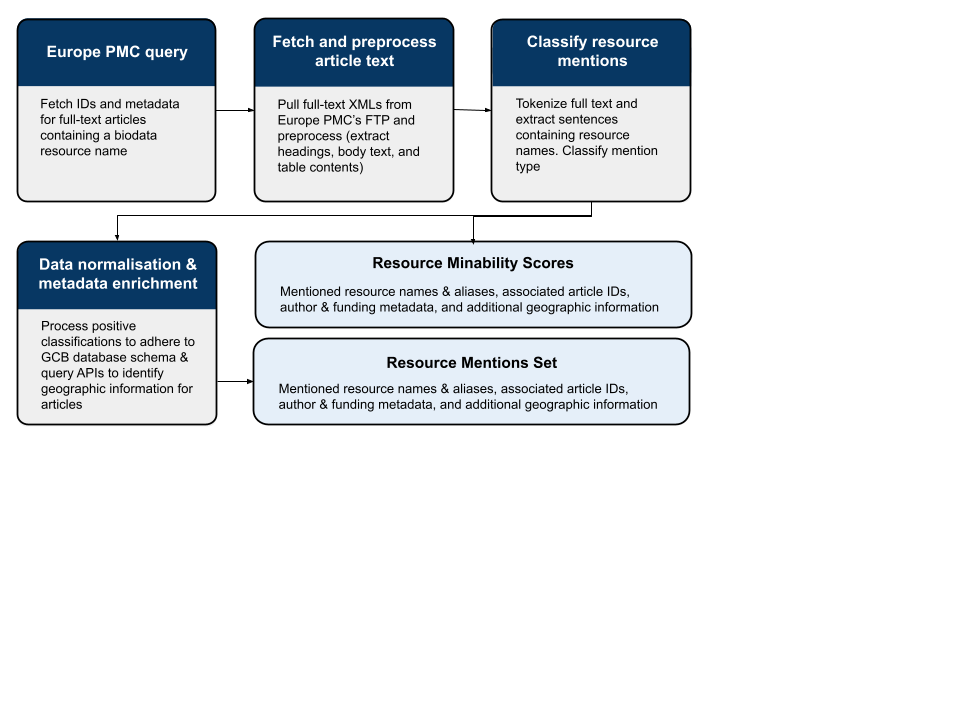

# GBC Mentions Analysis Workflow

# 🧭 Background

The [Global Biodata Coalition](https://globalbiodata.org) seeks to exchange knowledge and share strategies for supporting biodata resources. To develop an underlying evidence base to show the importance of biodata resources to the life sciences comminity at large, several data analyses were undertaken. All were based on mining published scientific literature, with the help of Europe PMC's APIs.

1. **A global inventory** : The aim here is to identify publications the describe a resources, and form a list of known biodata resources.
2. **Resource mentions** : Here, we wish to capture the usage of these inventory resources by detecting mentions of their names & aliases in open-access full-text articles. This seeks to capture the more informal type of resource citation (outside of official publication references and/or data citations).
3. **Data citations** : Finally, data from these resources can be cited directly by accession number (or other resource-dependent identifier). These are annotated as part of Europe PMC's text-mining service and have been imported into our database as an additional data source.

✅ **This repository holds the workflow used to identify resource mentions in open-access full-text articles.**

# Workflow Summary

The workflow identifies mentions of biodata resources within open-access, full-text publications in **Europe PMC**.
It runs in four main stages:

1. **Europe PMC query**
   Searches Europe PMC for full-text articles containing known biodata resource names, as well as custom aliases.
   Returns publication metadata (IDs, titles, authors, journal, year, etc.) for downstream processing.

2. **Fetch and preprocess article text**
   Downloads full-text XMLs from Europe PMC’s FTP service and extracts clean text from headings, body, and tables.
   Each article is normalised and saved as a single plain-text file ready for sentence tokenisation.

3. **Classify resource mentions**
   Tokenises each article’s text and uses a fine-tuned **SciBERT classifier** to detect sentences containing resource names or aliases.
   Each detected mention is assigned a *mention type* (e.g. clear use, ambiguous, or negative).

4. **Data normalisation & metadata enrichment**
   Filters and validates positive classifications to conform to the **GBC database schema**.
   Enriches articles with metadata via external APIs — for example, geographic information, funding bodies, and institutional data.

---

## Workflow Outputs

- **Resource Mentions Set**
  A compiled table of mentioned resources, associated article IDs, and enriched metadata (authors, funders, geography). Writting directly to
  the GBC database.

- **Resource Minability Scores**
  Aggregated statistics quantifying how easily each resource can be mined in the literature — a proxy for visibility and citation diversity.

---

An overview of the process is shown below:


# ⚙️ Setup

To reproduce this workflow, you’ll need **Nextflow (DSL2)** and **Conda** (or **Mamba**) installed locally.

```bash
# 1. Clone the repository
git clone https://github.com/<your-username>/gbc-mentions-analysis.git
cd gbc-mentions-analysis

# 2. Create and activate the Conda environment
conda env create -f environment.yml
conda activate gbc_mentions
```

Ensure `nextflow` is available on your `PATH`:
```bash
nextflow -version
```

# ▶️ Running the Workflow

All configuration is handled via `nextflow.config` and the `conf/` directory.

⚠️ Before running, it is important to create/update some configuration files
- `version.json`  : describes details about the run of the workflow (date, user, etc)
- `db_creds.json` : provides user credentials for database access

> ✅ Samples can be found in the `conf/` directory

### Basic run (local execution)
```bash
nextflow run .
```

### Advanced configuration
```bash
nextflow run . \
    --workdir_base /path/to/work/dir \
    --db_credentials_json conf/updated_db_creds.json
    --model data/models/model_name
    --chunks 2000
```

